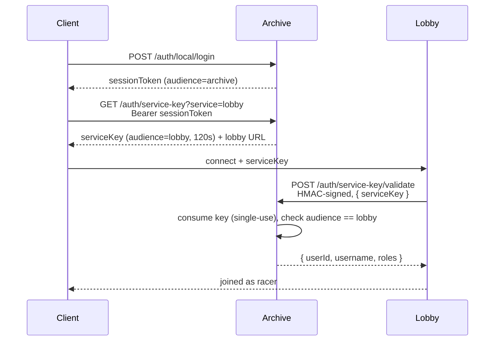

# Authentication

The archive is the sole issuer and the sole validator of identity in NFM World.
Nothing else holds a signing key, and nothing else can mint a credential.

Two credentials exist. They solve different problems and must not be confused:

| | **Session / service key** | **Service credential** |
|---|---|---|
| Represents | a **player** | a **machine** (the lobby) |
| Answers | "who is this player?" | "is this really the lobby?" |
| Form | opaque random token | HMAC-SHA256 request signature |
| Held by | the game client | the lobby's config |
| Lifetime | 30 days (archive) / 2 min (service key) | until rotated |

A player proves who they are with a token. A service proves what it is by
signing its requests. A lobby needs both: the player's key tells it *who joined*,
its own credential is what lets it *ask us to confirm that*.

---

## 1. Session tokens

### Audiences

Every session row carries an `audience`:

- **`archive`** — acts on this server directly (upload assets, like, search). This
  is what every login returns.
- **any service id from config** (e.g. `lobby`) — a *service key*. Redeemable
  **only** by that service, and worth **nothing** here.

This split is the whole point. A service key is handed to a third party, so it
must buy them nothing on the archive. Presenting one to an archive endpoint is
`403`, and it cannot be traded up for a key to any other service — minting
requires an `archive`-scoped token.

### Logging in — unchanged

`POST /auth/local/login`, the Discord OAuth flow, and account creation are
untouched. Same requests, same `sessionToken` in the response. Clients written
against the old API keep working.

```http
POST /auth/local/login
Content-Type: application/json

{ "username": "racer", "password": "…" }
```
```json
{ "username": "racer", "sessionToken": "ikntXklu…" }
```

That token is `archive`-scoped. Send it as `Authorization: Bearer <token>`.

Two behaviours worth knowing:

- **One archive session per user.** Logging in replaces the previous one, as it
  always has.
- **Logging in kills outstanding service keys.** Session rows cascade through
  `parent_token_hash`, so logging in again destroys every key minted from the
  old session. A player who re-authenticates has revoked everything they
  previously handed out.

  There is currently **no logout endpoint**. Deleting the session row is the only
  way to revoke a session out of band, and doing so cascades the same way. If a
  logout is added, it gets this revocation for free.

---

## 2. Service keys (client → lobby)

### Minting

```http
GET /auth/service-key?service=lobby
Authorization: Bearer <archive session token>
```
```json
{
  "serviceKey": "kP9x…",
  "expiresInSeconds": 120,
  "service": { "id": "lobby", "url": "http://localhost:7001" }
}
```

The client names the service **by id, never by URL**. The archive answers with
both the key and where that service currently lives, so the lobby's address is a
config detail the client learns at runtime — move the lobby, edit one line, no
client changes and no stale URLs baked into builds.

| Status | Meaning |
|---|---|
| `200` | key minted |
| `401` | missing/invalid session |
| `403` | token is a service key, not an archive session |
| `404` | no service with that id is registered |

### Redeeming

The client connects to `service.url` and presents `serviceKey`. The lobby
redeems it:

```http
POST /auth/service-key/validate
Authorization: NFMW-HMAC-SHA256 service=lobby,ts=1752436800,sig=5c3dfb11…
Content-Type: application/json

{ "serviceKey": "kP9x…" }
```
```json
{ "userId": 1, "username": "racer", "roles": ["moderator"] }
```

`roles` are names, not ids — a caller with no database gets everything it needs
to make authorisation decisions from this one response.

| Status | Meaning |
|---|---|
| `200` | redeemed; the player is who they claim to be |
| `401` | unsigned, badly signed, or stale request — **or** an invalid, expired, already-redeemed, or wrongly-scoped key |

The two `401` cases are deliberately indistinguishable: this endpoint must not
confirm which services exist or which keys are real.

### Properties

- **Single-use.** Redeeming destroys the key. A stolen key is worthless the
  moment the real player uses it, and a lobby that redeems twice gets `401` the
  second time — so a reconnecting client must mint a fresh key.
- **Short-lived.** 120s by default (`service_key_ttl_seconds`). It only has to
  survive the hop from client to lobby.
- **Audience-bound.** Redemption matches the key's audience against the service
  id that signed the request. A compromised lobby cannot redeem — or merely
  destroy — keys minted for anything else.

### End to end



---

## 3. Service credentials (lobby → archive)

The lobby authenticates by signing every request. There is no bearer token to
steal from a log.

### Header

```
Authorization: NFMW-HMAC-SHA256 service=<id>,ts=<unix seconds>,sig=<hex>
```

### String to sign

Five fields, joined by `\n` (LF, no trailing newline):

```
{METHOD}
{path + query}
{serviceId}
{unixTimestamp}
{lowercase hex sha256(body)}
```

Signed with HMAC-SHA256 under the service's secret, hex-encoded, lowercase.
An empty body still hashes — use `sha256("")`.

Everything that identifies the request is bound in, so a captured signature
cannot be moved to another route, another service, or another body:

| Field | Stops |
|---|---|
| method + path + query | replaying a signature against a different endpoint |
| serviceId | replaying it as a different service |
| timestamp | replaying it outside the skew window |
| body hash | swapping the body under a valid signature |

### Verification, in order

1. Parse `service`, `ts`, `sig`. Malformed → `401`.
2. Look up `service` in config. Unknown → `401` (never "no such service").
3. Reject if `|now − ts| > hmac_max_skew_seconds` (default 30). Requires the
   hosts be roughly NTP-synced.
4. Recompute the string to sign from the *actual* request.
5. Compare against **every** secret listed for that service, in constant time.
   Any match authenticates. No match → `401`.

### Signing it (C#)

```csharp
public static string Sign(string method, string pathAndQuery, string serviceId,
                          byte[] secret, byte[] body)
{
    var ts = DateTimeOffset.UtcNow.ToUnixTimeSeconds();
    var bodyHash = Convert.ToHexString(SHA256.HashData(body)).ToLowerInvariant();
    var stringToSign = string.Join('\n', method, pathAndQuery, serviceId, ts, bodyHash);
    var sig = HMACSHA256.HashData(secret, Encoding.UTF8.GetBytes(stringToSign));
    return $"NFMW-HMAC-SHA256 service={serviceId},ts={ts},sig={Convert.ToHexString(sig).ToLowerInvariant()}";
}
```

### Test vector

Check an implementation against these before pointing it at a real server:

```
secret (hex) : 000102030405060708090a0b0c0d0e0f101112131415161718191a1b1c1d1e1f
method       : POST
path         : /auth/service-key/validate
serviceId    : lobby
timestamp    : 1752436800
body         : {"serviceKey":"kP9xExampleKey"}

bodyHash     : 6b9db29378d1a76eaf34de26ccb085a1b148895a3fb4a7eab6bfdf49aac6b572
stringToSign : POST\n/auth/service-key/validate\nlobby\n1752436800\n6b9db2…b572
sig          : 5c3dfb114ee5d41428dd96d05c7ca89101a8be0fba80129dc6278262885db96a
```

Resulting header:

```
Authorization: NFMW-HMAC-SHA256 service=lobby,ts=1752436800,sig=5c3dfb114ee5d41428dd96d05c7ca89101a8be0fba80129dc6278262885db96a
```

---

## 4. Managing credentials

Services live in `config.toml`. There is no admin API and no database table —
registering a service is a config edit and a restart.

```toml
[[services]]
id = "lobby"                      # audience of its keys, and how it names itself when signing
url = "http://localhost:7001"     # told to clients; change freely
hmac_secrets = ["3f2a…"]          # hex, >= 32 bytes; all are accepted
```

Generate a secret with `openssl rand -hex 32`. Never commit one —
`config.toml` is gitignored; `config.template.toml` is the committed shape.

The `id` does double duty: it is the **audience** of every service key minted for
this service *and* the **key id** it signs with. One registry, so a service
cannot exist for one purpose but not the other.

### Rotating a secret

`hmac_secrets` is a list precisely so this needs no flag-day — every listed
secret is accepted:

1. Add the new secret alongside the old one. Restart.
2. Move the lobby onto the new secret. It keeps working throughout.
3. Remove the old secret. Restart.

### Revoking a service

Delete its `[[services]]` entry and restart. That instantly kills both its
ability to authenticate *and* the ability to mint any new keys for it —
`/auth/service-key?service=…` starts returning `404`. Keys already in flight
become unredeemable, because redemption requires the service to authenticate.

### Startup validation

The server refuses to boot on a misconfigured service, rather than failing later
at request time: a non-hex secret, a secret under 32 bytes, an empty
`hmac_secrets`, or a service trying to claim the reserved id `archive`.

---

## 5. Properties and non-goals

**What this design buys**

- The archive is the only issuer *and* the only validator, so revoking a session
  takes effect on the **next join** — no TTL to wait out, no revocation list to
  distribute. (This is why tokens are DB-backed and opaque rather than signed
  JWTs; that design was considered and dropped as too complex.)
- Compromising the lobby — the cheater-facing surface — yields no ability to
  mint tokens, impersonate players against the archive, or touch any other
  service.
- Because the archive sees every redemption, it can later verify that a lobby
  reporting a match result actually had keys issued to those exact players for
  that exact lobby. A stateless token could not support that.

**Non-goals, and what they imply**

- **Not replay-proof within the skew window.** The signature authenticates; it
  does not make a request unique. Harmless for `validate` because redemption is
  single-use — but **any future endpoint reached this way must be idempotent**.
  When `/match-result` is added, key it on a match id.
- **No mid-session revocation.** Banning a player does not eject them from a
  match already in progress; the lobby would have to re-check. Fine for v1.
- **The archive is an availability dependency for joining a lobby.** If it is
  down, no one can validate a key and no one can join. It is already a
  dependency for login and assets, so this adds no new failure domain.
